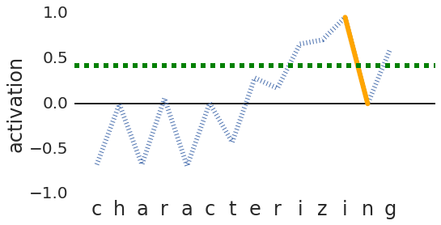

# Character Eyes

Code for our project analyzing character level taggers, accepted at [BlackboxNLP 2019](https://blackboxnlp.github.io/). 



## Contents
- `model.py` - A fully character level tagger model, implemented in [DyNet](http://dynet.io/). It has support for **asymmetric** bi-directional RNNs, which we found had performance effects depending on linguistic properties of the language. 
- Pretrained models for 6 of our 24 languages
- Ready-to-train datasets (from [Univseral Dependencies 2.3](http://universaldependencies.org/)) for all 24 languages
- [This notebook](https://github.com/ruyimarone/character-eyes/blob/master/PDI.ipynb), which produces some of the figures in our paper and gives an overview of our method and metrics. *This is the best place to start if you want to use our project.*

Much of the code is modified from [Mimick](https://github.com/yuvalpinter/Mimick), a character level system that can replace OOVs or UNKs with learned representations approximating a closed vocabulary set of word embeddings. 

## Citation format

When using our work, please use the following `.bib` entry:

```
@article{charactereyes,
  title={Character Eyes: Seeing Language through Character-Level Taggers},
  author={Pinter, Yuval and Marone, Marc and Eisenstein, Jacob},
  journal={arXiv preprint arXiv:1903.05041},
  year={2019}
}
```
